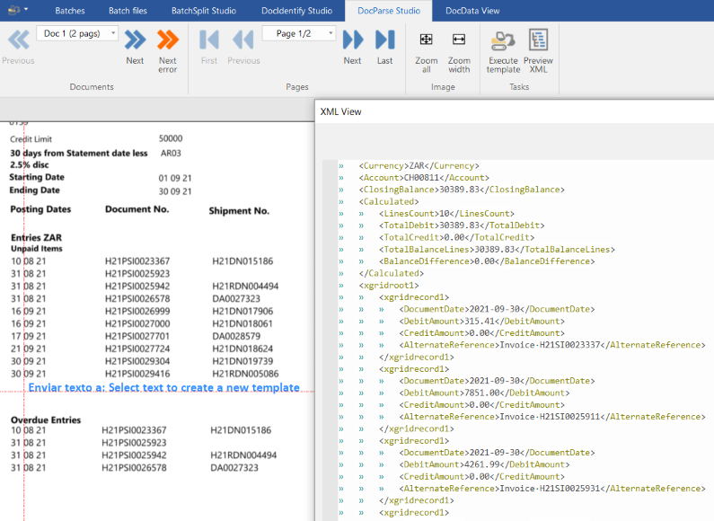

# ChronoTxt - Advance PDF/Text to XML parser


## What ChronoTxT is:

ChronoTxT is a set of tools to automate conversion of unstructured documents to fully structured XML files.



## Basic ChronoTxT concepts:

### Classes

Allows to define data structures for the documents we want to process. They're defined in an XML file.
Classes also allows to configure the output format for the extraction.

```xml
<!-- BASIC INVOICE: Generated example template-->
<Invoice>
	<Header>
		<SupplierId type="xs:string" link_to_template="1" mandatory="1" notes="Value used to identify the invoice generator"/>
		<InvNumber type="xs:string" mandatory="1" notes="Invoice number generated by supplier"/>
		<InvDate type ="xs:date" mandatory="1" notes="Invoice date"/>
		<PurchaseOrder type ="xs:string" mandatory="0" notes="Purchase order"/>
		<Currency label="Currency" type ="currencyiso3" mandatory="0" default_value="%default_currency%"/>
	</Header>
	<Totals>
		<TotalNet label="Net" type ="xs:decimal" mandatory="1"/>
		<TotalTax label="Tax" type ="xs:decimal" mandatory="1"/>
		<TotalGross label="Gross" type ="xs:decimal" mandatory="1"/>
	</Totals>
	<LineItems minoccur="0" maxoccur="infinite">
		<Item repeatingnode="1" minoccur="1" maxoccur="infinite">
			<TaxCode type="xs:string" mandatory="0"/>
			<CodeId type="xs:string" mandatory="0"/>
			<ItemId type="xs:string" mandatory="0"/>
			<Description type="xs:string" mandatory="0" conv_fun="removecr"/>
			<Net type="xs:decimal" mandatory="1"/>
			<Gross type="xs:decimal" mandatory="0"/>
		</Item>
	</LineItems>
	<TaxCodes minoccur="0" maxoccur="infinite">
		<TaxCode repeatingnode="1" minoccur="0" maxoccur="infinite">
			<TaxCode type="xs:string" mandatory="0"/>
			<TaxRate type="xs:decimal" mandatory="0"/>
			<TaxBase type="xs:decimal" mandatory="0"/>
			<TaxAmount type="xs:decimal" mandatory="0"/>
		</TaxCode>
	</TaxCodes>
</Invoice>
```

### Jobs
Contain the configuration to process a group of document types:
* Default classes for templates.
* Default formats for dates, numbers...

### Batches

A Batch is a group of input files, a batch must below to a Job.

### Input files

ChronoTxT import files as primary source of data. Files can be splitted or joined into documents using the Split Studio to generate documents.

### Documents
A document is a set of 1 or more pages.
The document must be set to a template using the Identify Studio in order to allows the data extraction.

### Templates
Templates allows to define extract objects and properties in an specific document type. Templates are global objects and can be used on any Job.
* **Classes**: A template can generate one or more classes.
* **Reference point**: It's a text search expresion used to create sections like headers, footers and custom ones.
* **Text Section**: It's a block of text inside a document, sections can be nested. Sections can be created as vertical or horizontal ones.
* **Dumpers**: Are extraction objects, that allows to get data from the document and name them.
    * Labeled fiels
    * Grids
    * Full text capture
    * Address blocks
* **Data Map**: Allows to link a dumper item with a class item allowing ChronoTxt to structure the data in the document.
