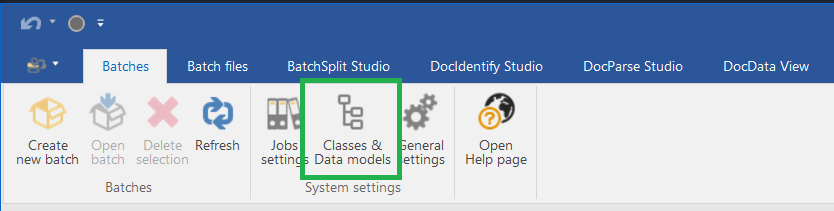

# How to Start

## 1.- Creat/Edit your Classes

Take a moment to define how and what do you want to receive from your documents. The Classes will allows you to define the final data structure for your applications.

[Classes reference page](./reference/xml_data_models)

## 2.- Configure a Job

Create a Job to process your document.

Default classes for new templates: Allow to set classes for templates created on this Job.

Job default formats:
* Default date Format
* Default currency
* Default decimal format
* Default negative numbers format

Hotfolder:
* Comming soon, allow to process files unatended.

### 3.- Import files into a Batch

#### Manual Batch Creation

Use the ChronoTxt "Batch Files" tab to add files manually to the current Batch.

#### Using ChronoCMD to watch on folders.

You can automate the creation of batches using the ChronoCMD utility.

### 4.- Batch Split Studio

Allow to set basic split rules on your Job. Usually you will create one file as one document but sometimes you need to split or join different files to create documents.

### 5.- Batch Identify Studio: Identify document template.

You can asing a name to a template, (ex: Supplier).
Use text search on the document to identify it, the Identify Studio will help you in configuring a good identification statement.
Usually you will use unique information that belong to the document to set the template, info like Phone number, vat number, grid headers...

### 6.- DocParse Studio: Extract & Map document information

Configure the extraction objects and map them to the template classes to generate your output.

