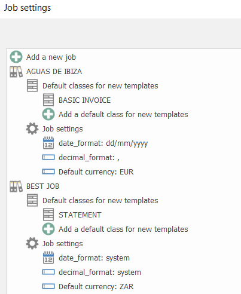

# ChronoTxt Jobs

A Job allows to setup a basic enviroment to process documents.

Default classes for new templates:
* Defines with default classes will be asigned to new templates on this job.

Job settings:
* date_format: set default date format for input documents.
* decimal_format: set default decimal format for input documents.
* Default currency: set default currency for input documents.